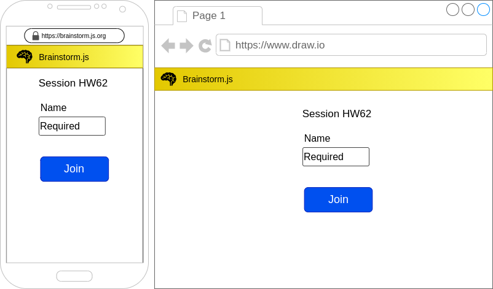

% Brainstorm.js
% Sam Sheehy
% 13 February 2021

_Like jackbox.tv but for brainstorming ideas._

# Scenario

A facilitator is going to lead a brainstorming session. They want to cut down on post-its and paper. They use this tool to create a challenge and get a shareable code, which they share with participants at the beginning of the session.

The participants join and get 20 mins to submit ideas. Afterwards, they iterate through these (as prompted by the platform). When the platform shows an idea, the submitter briefly explains it with more context. The users can then rate it (1 to 5 or maybe choice of "love it"/"impossible"/"valuable"/"easy"/"original" or maybe "interesting!"/"not my favourite").

> **Note**: js.org allows hosting on Heroku, so the URL could be something like `brainstorm.js.org`.

At the end of the session, the system puts forward the most highly rated ideas. It also assembles all the submissions and ratings in an excel file which the host can download.

The team view the top ideas and ask those that submitted them to write more detailed summaries about the ideas. These summaries will be then developed further and further until they become their own projects or they are discontinued.

# Screen by Screen

## Landing

This is the page a visitor sees when they put in the root URL. It allows them to either start a session as a host or join an existing session as a guest.

The components of this page are as follows:

* One button labelled "New Session". When they click here they go to the [Host's Session Setup Page](#session-set-up-host).
* Another button labelled "Join Session". When they click here they see an input for a code and the prompt, "Enter your session code here. Ask the host for this!". When they enter the correct join code, they are taken the [Guest's Session Setup Page](#session-set-up-guest). When the enter an incorrect join code, they are shown the error message "No sessions exist with this join code".

It looks like something in Figure \ref{landing}.

> **Thought**: Maybe this page should have some copy explaining the process of a session using this app.

## Session Set Up, Host

This page allows the host to receive guests to their session and enter the session prompt.

The components of the page are as follows:

* The session code
* Instructions "Share this code with your guests"
* An empty list labelled "Guests"
* A disabled button labelled "Start Session".
* A text field labelled "Idea Prompt - what do you want ideas about? This will be shown to all users on their device."

It looks like something in Figure \ref{host-set-up}.

> **Thought**: instead of entering the code directly users could GET a URL with the code as a query argument. The server can check if the session exists then return the joining form.

As guests successfully join the session, their names appear in the list. When at least one guest has joined the "Start Session" button becomes enabled.

When the host is satisfied that all the attendees have joined correctly, they click "Start Session", and they are  to the [Host's Active Session Page](#active-session-host). When this happens the Guests are automatically directed to the [Guest's Active Session Page](#active-session-guest).

## Session Set Up, Guest

This is where guests join the session and input necessary details like their name. They are directed to this page after having input an existing session code in the [Guest Setup Page](#session-set-up-guest).

The components of this page are as follows:

* A text input labelled "Name"
* A button labelled "Join" (the button is disabled if the name field is empty.)

This looks something like Figure \ref{guest-set-up}.

When they enter their name and click join, their device attempts to join the host's session. If they join successfully, they see the name they input, a message that says "Waiting for the host to start the session" and a button labelled "Exit Session" (see Figure \ref{guest-wait}). If there is an error, they see a message saying "Error: please attempt to rejoin".

If the guest clicks on "Exit Session", an alert will ask them to confirm.

When the host starts the session, the guest's page automatically goes to the "Session Page, Guest, Active Session" page.

## Active Session, Host

This is the main page of an active session. All submissions appear here as they are submitted.

The components of this page are as follows:

* The prompt entered previously in a large heading with empty space underneath.
* The guests' submissions.
* There is also the session code displayed in a non-intrusive way. This session code should appear on all consecutive screens related to this session.
* A button labelled "Start Review". When the host clicks here, it ends the active session and they are taken to the [Host's Review Page](#review-page-host).

This page could be screen-shared via video conference and act like a dashboard for everyone to track the progress of the session.

It looks something like Figure \ref{active-session-host}

## Active Session, Guest

This is the main session page for guests and where they will enter all their submissions.

The components of this page are as follows:

* The host's prompt
* A text field
* A button labelled "Send"

They type their idea into text box and when they click send, it resets the box and shows a simple pop-up saying "Sent!". The font in the input field is large to discourage the guest writing too much text. There may even be a character limit.

They repeat entering ideas and clicking send until the host initiates the review session. At that point they are automatically redirected to the [Guest's Review Page](#review-page-guest).

This looks something like Figure \ref{active-session-guest}.

## Review Page, Host

This page will show the submissions one by one and allow the guests an opportunity to elaborate further on their ideas.

The components of the page are as follows:

* The session prompt
* A timer counting up
* One of the submitted ideas underneath the prompt with a timer counting up.
* The name of who submitted it.
* A button labelled "Next Idea"
* A counter indicating how many guests of voted on the idea.
* There is a progress display that indicates how many ideas are left to review.

The host asks the submitter to explain the idea in a few sentences, then asks the participants to rate the idea. When the host is satisfied they click on the button labelled "Next Idea" and the next idea is displayed. The host repeats the above until the group has seen all the ideas.

The page looks something like Figure \ref{review-page-host}

Once all the group has reviewed all the ideas, instead of "Next Idea" the button says "View Results". When the host clicks here they are taken to the [Results Page](#results-page).

## Review Page, Guest

This page presents to guests one submission at a time and allows them to give it a point (or some other sort of assessment).

The components on this page are as follows:

* The main prompt
* The current idea under review (as also displayed on the host's view)
* The rating buttons (see overview for some possibilities)
* A button that says "Confirm" (at first disabled).

When they click a rating button, it becomes highlighted and the "Confirm" button becomes enabled. The guest then clicks Send and then they see a message that says "Wait for the host to move to the next idea".

This looks something like Figure \ref{review-page-guest}.

## Results Page

The Results Page is the same for guests and the host. It allows the whole group to review the submissions in order of points received.

The components on this page are as follows:

* All the submissions in a table ranked according to their ratings.
* The ratings for each idea are also displayed.
* A button labelled "Download as XLS". When a user clicks this, they download the whole table as an Excel file.
* A button that says, "Exit and back to Home Page" that will take users to the [Landing Page](#landing).

This looks something like Figure \ref{results-page}.

If the user tries to leave the page without downloading the table, they get an alert that says "If you leave now, you won't be able to come back to this page and all data will be discarded." with the options "Leave Session Permanently" and "Stay and Save".

